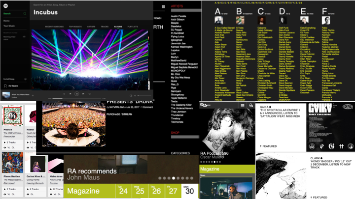
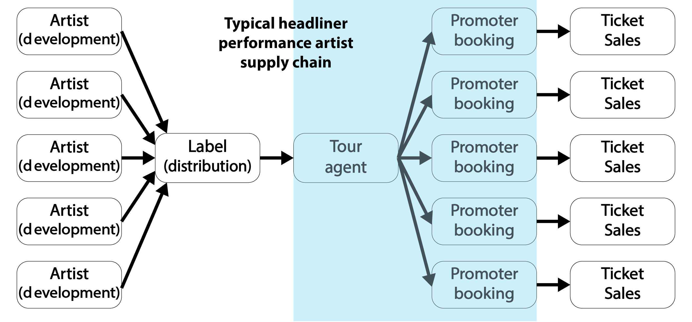
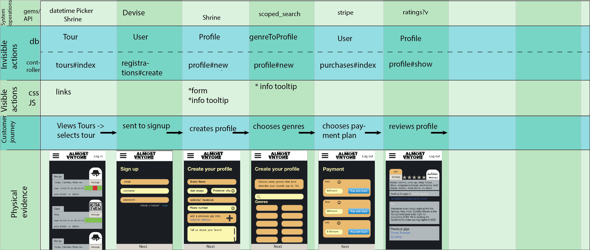
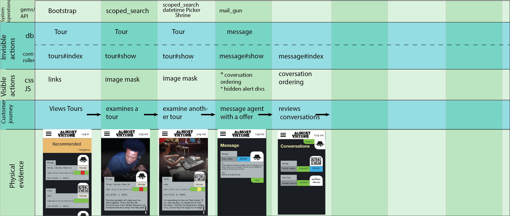
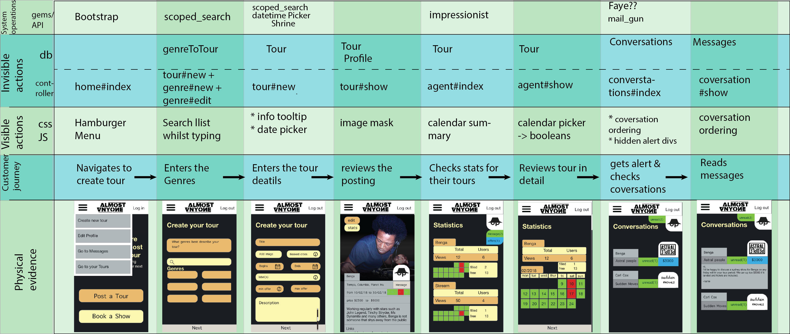
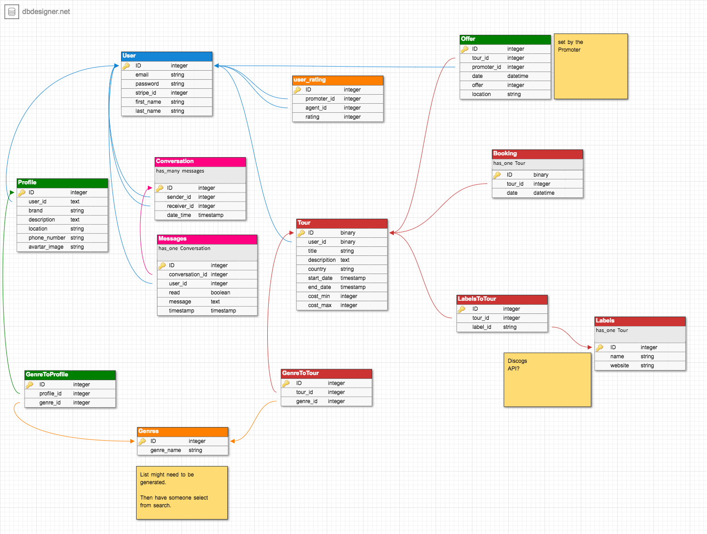

# Almost Anyone

This rails app is a two sided marketplace that allows the users to act as both 'Tour Agent' and 'Promoter'.

As a MVP the app will allow users to place offers for upcoming tours and place tours.

Minor version updates will add features such as messaging with file transfer, alerts on offers and emails on likely tours of interest

Major version updates will add more categories such as comedy acts and conference speakers.
___
## Gems

[devise](https://github.com/plataformatec/devise)

[rspec](https://github.com/rspec/rspec-rails)

[shrine](https://github.com/janko-m/shrine)

[aws](https://github.com/aws/aws-sdk-ruby)

[stripe](https://github.com/stripe/stripe-ruby)

[mail gun](https://github.com/mailgun/mailgun-ruby)

[impressionist](https://github.com/charlotte-ruby/impressionist)

[scoped_search](https://github.com/wvanbergen/scoped_search)

[guard-livereload](https://github.com/guard/guard-livereload)

[discogs-wrapper](https://github.com/buntine/discogs)

[cloudinary](https://cloudinary.com//documentation/rails_integration)

## Planning


### User Journeys

#### Promoter
The Promoter is the event coordinator for the show in their city, They book and pay for all the performing artist and promote the show via their brand.
* I to break into the market, so that I can put on big acts in my town/city
* I want to see a range of upcoming tours, so that I can make the best bookings
* Because I’m lazy, I want to have upcoming tours that match my genres
* I want to make offers on tours and know what range to offer them

#### Tour Agent
The Tour Agent arranges a tour including flights and off day accomodation, across a period of time and country or region. They pay the artist and make money by selling the performing artist to promoters. Often they also present a show in their city via their brand.
* I want a to offer the shows to more people, so that I can get the highest price possible
* I want to see  statistics on the interest on each tour, so  that I can have data
* I want to my profile to be able to show off my brand

#### Mood Board

*The mood board is inspired by some of the worlds leading digital music stores, ticket retailer, venues, and record labels*

There was a commonality of colour themes with dark backgrounds and a minimal colour pallet

#### Performing artist supply chain

*Almost-anyone focuses on the B2B relationship between Tour agent and Promoter*


Modifying a technique used to create service blue prints I created 3 user journeys, the Guest, the Promoter, and the Agent.
The blue prints are designed focus on the user journey and define the actions, procedures & evidence surrounding the user as Visible actions => Html  CSS , Invisible actions => rails routes, datebases, models and controllers, System actions => gems, Heroku, API's Rauls itself and Physical evidence => page items such as buttons, form inputs, nav bars etc that the user can easily identify.  for service blue prints a cafe would have contain visible action => waiter takes order, invisible => chef cooks meal, system => eftpos & evidence => tables chairs, coffee machine, But the same principals apply for a website.

##### Guest Journey

##### Promoter Journey

##### Agent Journey



#### Data Base design


## Getting Started

```
rails new almost-anyone --skip test -d postgresql
```

1. **install devise** - using the Github guide
1. **install shrine** - using Github guide
  * **link ASW**
  * create profile scaffold

```
rails g scaffold Profile user:reference brand:string  location:string phone_number:string image_data:text bio:text
```
1. **install rspec** - using Github guide
1. add first_name & last_name to User model with devise registration [github guide](https://github.com/plataformatec/devise/wiki/How-To:-Allow-users-to-sign-in-using-their-username-or-email-address)
1. create Tour scaffold

```
rails g scaffold Tour user:reference title:string  description:text country:string image_data:text bio:text start_date:timestamp end_date:timestamp min_cost:integer max_cost:integer

rails db:migrate

```
1. create genre table.

```
rails g model Genre name
rails db:migrate

rails g migration CreateJoinTableProfileGenre profile genre
rails g migration CreateJoinTableTourGenre tour genre
```
then add below to the form

```
<div class="field">
  <%= form.label :genres %>
  <%= form.collection_select(:genres, Genre.order(:name),:id,:name,{}, {multiple: true, include_blank: false}) %>
</div>
```
Now the form will look to the Genres to find the selection and send the :id and :name to the controller in the *weak* params. After the new Tour or Profile is made add the below code to link the genres via the join table.

```
temp_genres = params[:tour][:genres]
temp_genres.each{|genre_id|
  @tour.genres << Genre.find(genre_id) unless genre_id.blank?
}
```
### Calendar Model

The custom calendar model uses a number of methods to display the Tour date range as either a week summary or total days, it also displays the booked days

**Calendar.new(start_date, end_date)** - Creates a new calendar object with

##### *methods*

**createCalendar**  - creates a calendar array stored as @cal

**bookDays(*days)** - alters the @cal array to include true and false (available and booked) booleans

**displayCalendar** - outputs the @cal array as html for the calendar Sunday to Monday, with project css appropriate class tags (note: that .html_safe rails method needs to be added)

**displayWeek**     - outputs the @cal array as html for the week Sunday to Thursday, Friday, Saturday, with project css appropriate class tags (note: that .html_safe rails method needs to be added). These with entertainment bookings the most common day to book is Fridays and Saturdays.

Add Stripe

[stripe guide](https://stripe.com/docs/checkout/rails)
]
*to be continued*

### bookings

First the user must request a Booking with a Offer.
```
rails g scaffold Offer tour:references user:references date:date price:integer location:string

rails g scaffold Booking tour:references date:date
rails db:migrate
```
Now take the Offer form and make a partial copy in the views/tour then in tour/show.html.erb add a render to that partial. Change the form to have a hidden_field for the tour_id input and pass the tour_id into the partial and modify the date input (see bugs and fixes).


### Make the rating model

ratyrate gem

in ```db/migrate/<the new migration> ``` add default to 0 to score ```t.integer :score, default: 0```

Follow the guide on ratyrate..
The gem is optimised for rails 4 which creates some Bugs
Firstly, rails 5 doesnt have jQuery pre-installed.
```
gem 'jquery-rails', '~> 4.3', '>= 4.3.1'
```
Secondly, add [5.1] after the migrations names. . .
Thirdly, the images might be in a weird spot.

Then it kinda just works..

### impressionist

```
rails g impressionist
```
then add [5.1] after ActiveRecords
```
 rails db:migrate
```
add to desired controller (Tours in this case), and indicate the action(or leave off for whole controller).
```ruby
class ToursController < ApplicationController
impressionist :actions=>[:show]
end
```
make the model impressionable
```ruby
class Tour < ApplicationRecord
is_impressionable
end
```
Now the impressions can be counted by
```ruby
@tour.impressionist_count
```
Easy a that and it worked first time.

### Search

Search was very easy to implement by following this guide [Create a Simple Search Form in Rails](http://www.rymcmahon.com/articles/2).
However the guide only walks through a very simple search, and i'd like to have a few other search options.
* Search a join table to find by genres
* Let agents search for promoters via city (requires a new page)
* search through offers and messages via dates and names.

### Cloudinary

Before posting on Heroku i need cloud storage for my tour and profile images. And it need to integrate with shrine. [shrine-cloudinary guide](https://github.com/janko-m/shrine-cloudinary)
```
gem "clourinary"
gem 'shrine-cloudinary'
```
Just change the shrine initializer and set up the .env file.

### Offers

The offers have a fair amount of logic and styling in them

##### login

##### styling


### forms

 [Using Ajax](https://launchschool.com/blog/the-detailed-guide-on-how-ajax-works-with-ruby-on-rails)

This will create a form that will got the new action of offer
 ```
<%= form_with url: new_offer_path, method: "get", remote: true%>
 ```
This tell rails to load the new.js.erb file when the new action is fired.

```ruby
def new
  respond_to :js
end
```
```js
document.getElementById....render_form
```
```ruby
def create
  @task = Task.new(name: params[:name])
  if @task.save
    @tasks = Task.all
    respond_to :js
  end
end
```


```
<!-- below is a way to get a searchable dropdown menu-->
      <!-- <div class="field">
        <input type=text list=browsers name="genre">
          <datalist id=browsers >
            <%Genre.all.each do |g|%>
             <option> <%=g.name%>
            <%end%>
          </datalist>
      </div> -->
```


### Bugs and Fixes

* Tour index page faults when Tour is created and no profile created. ```<%=tour.user.profile.brand%>``` **fix** forcing the user to create a profile on sign up and removing any seed data that was made without a seed profile.

* Date selecting for offer dates and booking dates are not restricted to the Tour dates. **fix**```<%= form.date_select :date, start_year:  @tour.start_date.year, end_year:  @tour.start_date.year ``` => will restrict the year to only the Tour years, However there is **not** a way to restrict the days and months to only show the ranged date. The most commonly suggested fix is to use a jQuery date picker calendar.

However, validators are added to the Models preventing input dates outside of the Tour dates.

### Security

Unfortunately, i had a issue with my 'dotenv-rails' gem that helps to prevent the uploading of .env file where all my keys are stored. I installed the gem after my first commit and even though the gem was installed and .env was on my git .ignore it was still updated to github with every change, which may have lead to unauthorised usage of my keys. To prevent any further headaches i manually prevented the .env file being put on git hub using the codes below.  

```
git update-index --skip-worktree .env
```
```
git update-index --no-skip-worktree .env
```
This may have been the reason why my AWS keys were used to reserve space on  SSD cloud storage in all AWS servers around the world, creating a $6500 bill in just 12 hours. . . And a week of correspondence to have the fees removed. And may explain weird sms's about my stripe test key being used at 4am in the morning.

## Running the tests

Testing was a issue to due lack of time to learn Rspec.
However when developing the Calendar model I tested constantly using a simple method of writing out the desired outcome and then check it against my actual outcome, if they were the same it passed true and i knew the my test had past.  

Of the rSpec testing completed I ran into a number of problems for getting my tests past the validations that wrote. Although I did get past a number of test  created by rSpec, and wrote some very simple tests myself.


## Deployment

Useful commands

```
git remote -v

heroku logs -t

heroku apps

heroku run rails c --app name

heroku pg:psql --app almost-anyone

heroku run bash

heroku pg:backups --app name
heroku pg:backups:capture --app name

heroku run rake db:migrate:status --app name
heroku run rake db:migrate:redo VERSION=<id from previous command> --app name
```

### Heroku

* deployment must be uniquely name across the whole system
* uses build packs to automatically deploy
* having ruby version in your gem file is a good idea (not vital)
* brew install Heroku (for the command line Heroku interface. )


1. git remote add demo https://git.heroku.com/*name*.git
1. git push demo master *(this will upload the delpoyment)*
1. heroku logs -t --app *name*
1. heroku run rake db:migrate --app name


* pushing a branch to heroku ``` git push name branch:master ```
* this may need use to *re-write history* ``` git push -f name branch:master ``` **THIS IS A TERRIBLE IDEA IN A TEAM ENV**... but individually its okay.

==
